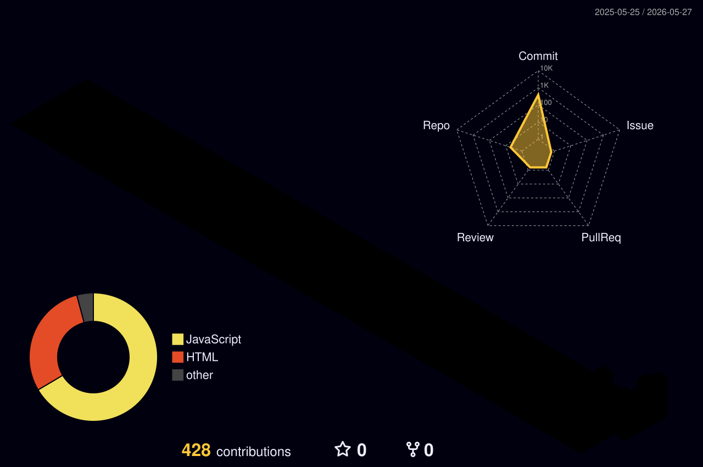

<div align="center">


# 🚀 Awais Tahir

### Finance Professional • Data Analyst • Fintech Founder • AI Builder


<br>


</div>

---

# 💫 About Me

<table>
<tr>
<td width="58%">

```yaml
Name: Awais Tahir

Roles:
  - Finance Professional
  - Data Analyst
  - Fintech Founder
  - Tech Enterpreneur

Company:
  - Axiom Fintech Solutions

Core Expertise:
  - Bookkeeping & Accounting
  - Financial Reporting
  - Data Analytics
  - Business Intelligence
  - AI Automation
  - Fintech Systems
  - Business Process Automation

Tools & Platforms:
  - Microsoft Excel
  - Google Sheets
  - Power BI
  - SQL Databases
  - Python Analytics
  - Pandas & NumPy

Currently Learning:
  - AI in Finance
  - Advanced Data Analytics
  - AI Agents & Automation
  - Fintech SaaS Systems

Mission:
  Building intelligent financial systems
  powered by Data, Automation & AI 🚀
```

</td>

<td width="42%">


<br><br>


<br><br>


</td>

</tr>
</table>

---

# 📊 Analytics & Finance Tech Stack

<div align="center">

## 📈 Analytics & Reporting


<br><br>

## 🗄️ Databases & Querying


<br><br>

## 🐍 Python Data Analytics


</div>

---


# 🔥 GitHub Streak

<div align="center">


</div>

---

# 📈 Contribution Activity

<div align="center">


</div>

---
---

# 🌌 3D Contribution Graph

<div align="center">



</div>

---
# 🚀 Current Focus Areas

<div align="center">

| 🚀 Domain | 📄 Focus |
|---|---|
| 🤖 AI Finance Systems | AI-powered financial automation & assistants |
| 📊 Business Intelligence | Interactive Power BI dashboards & KPI systems |
| 💹 Financial Analytics | Data-driven finance reporting & insights |
| ☁️ Fintech Infrastructure | Scalable finance technology solutions |
| 📈 Data Automation | Automated analytics & reporting workflows |
| 🧠 AI Business Systems | Intelligent automation & AI integrations |

</div>

---

# 🧠 Professional Expertise

```text
✔ Bookkeeping & Accounting
✔ Financial Accounting & Reporting
✔ Power BI Dashboards & KPI Tracking
✔ Excel Automation & Advanced Formulas
✔ Google Sheets Automation
✔ SQL Data Analysis & Querying
✔ Python Data Analytics
✔ AI-Powered Financial Systems
✔ Business Intelligence Solutions
✔ Fintech Product Development
✔ Data Visualization & Reporting
✔ Business Process Automation
```

---

# 🏆 GitHub Trophies

<div align="center">


</div>

---

# 🌐 Connect With Me

<div align="center">

<a href="https://www.linkedin.com/in/iamawais1628">

</a>

<a href="https://www.axiomfintechsolutions.com">

</a>

<a href="mailto:iamawais1628@gmail.com">

</a>

</div>

---

# 🐍 Contribution Snake

<div align="center">


</div>

---

# 💡 Quote

<div align="center">

### ✨ “Transforming Finance through Data, Automation & Artificial Intelligence.”

</div>

---

# 👀 Profile Views

<div align="center">


</div>

---

<div align="center">

## 🚀 Thanks For Visiting My Profile


</div>
